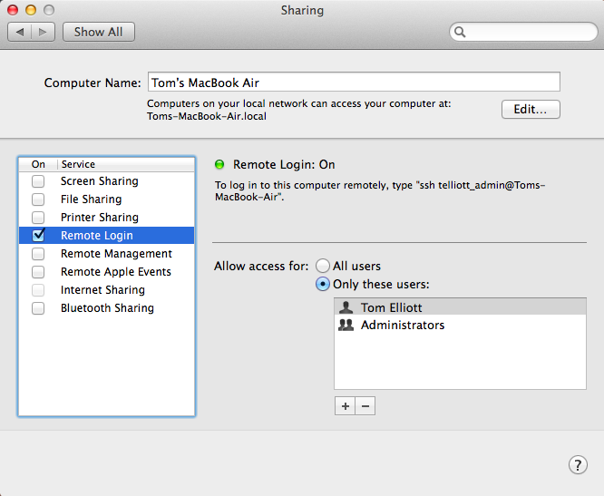

.. _server:

##########################
Using SSH for remote login
##########################

**SSH**

Various utilities for ``ssh`` are in ``/usr/bin``

.. sourcecode:: bash

    $ ls /usr/bin/ssh*
    /usr/bin/ssh
    /usr/bin/ssh-add
    /usr/bin/ssh-agent
    /usr/bin/ssh-keygen
    /usr/bin/ssh-keyscan
    $ 

On my machine, server keys are in ``/private/etc/``.  With the ``-l`` flag, ``ssh-keygen`` can get the fingerprint of the public key that my machine uses when it acts as a file server for remote connections.

.. sourcecode:: bash

    $ ssh-keygen -l -f /private/etc/ssh_host_rsa_key.pub
    2048 66:9d:5e:28:32:60:65:ec:99:77:09:87:73:f4:4b:c7   (RSA)

This public key is similar to what we saw before:

.. sourcecode:: bash

    $ hexdump -C /private/etc/ssh_host_rsa_key.pub
    00000000  73 73 68 2d 72 73 61 20  41 41 41 41 42 33 4e 7a  |ssh-rsa AAAAB3Nz|
    00000010  61 43 31 79 63 32 45 41  41 41 41 44 41 51 41 42  |aC1yc2EAAAADAQAB|
    00000020  41 41 41 42 41 51 44 4f  34 4b 6a 7a 76 30 2f 49  |AAABAQDO4Kjzv0/I|

with the -v flag, ``-l`` will give the ASCII art representation of the public key.

Try to connect:

.. sourcecode:: bash

    $ ssh telliott_admin@127.0.0.1
    ssh: connect to host 127.0.0.1 port 22: Connection refused

Turn on remote login in System Prefs > Sharing (and turn off WiFi if you’re as paranoid as I am).

Then from a new Terminal window

.. sourcecode:: bash

    $ ssh telliott_admin@127.0.0.1
    The authenticity of host '127.0.0.1 (127.0.0.1)' can't be established.
    RSA key fingerprint is 66:9d:5e:28:32:60:65:ec:99:77:09:87:73:f4:4b:c7.

Since the fingerprint matches what we got by direct inspection of the host’s RSA public key, we’re good.

.. sourcecode:: bash

    $ ssh telliott_admin@127.0.0.1
    The authenticity of host '127.0.0.1 (127.0.0.1)' can't be established.
    RSA key fingerprint is 66:9d:5e:28:32:60:65:ec:99:77:09:87:73:f4:4b:c7.
    Are you sure you want to continue connecting (yes/no)? yes
    Warning: Permanently added '127.0.0.1' (RSA) to the list of known hosts.
    Password:
    Last login: Fri May 30 08:23:59 2014
    
Test it out:

.. sourcecode:: bash

    $ say I sure love being inside this fancy computer
    
To quit:

.. sourcecode:: bash

    $ logout
    Connection to 127.0.0.1 closed.

Examine the public key of this host:

.. sourcecode:: bash

    $ ls ~/.ssh
    known_hosts
    $ cat ~/.ssh/known_hosts 
    127.0.0.1 ssh-rsa AAAAB3NzaC1yc2EAAAADAQABAAABAQDO4K..
    $
    
A better alternative is to look at the key fingerprint

.. sourcecode:: bash

    $ ssh-keygen -l -f ~/.ssh/known_hosts 
    2048 66:9d:5e:28:32:60:65:ec:99:77:09:87:73:f4:4b:c7 127.0.0.1 (RSA)
    $ 
    
What’s happened is that the client, my account (which is the same one I’m trying to login to, for convenience), has added 127.0.0.1 (local host) to the list of known hosts.   Once you've added the host to the list of know hosts, you should not see this message again. If that happens, it would suggest that a ”man in the middle” is trying to impersonate the server, using a different key. 

The next step is to use RSA keys to authenticate the login, rather than my account password. One can use either an RSA or a DSA key.  According to this

http://security.stackexchange.com/questions/5096/rsa-vs-dsa-for-ssh-authentication-keys

DSA is faster for signature generation but slower for validation, slower when encrypting but faster when decrypting and security can be considered equivalent compared to an RSA key of equal key length...The security of the RSA algorithm is based on the fact that factorization of large integers is known to be "difficult", whereas DSA security is based on the discrete logarithm problem.

To generate an RSA key pair, simply do

.. sourcecode:: bash

    $ ssh-keygen -t rsa
    Generating public/private rsa key pair.
    Enter file in which to save the key (/Users/telliott_admin/.ssh/id_rsa): 
    Enter passphrase (empty for no passphrase): 
    Enter same passphrase again: 
    Your identification has been saved in /Users/telliott_admin/.ssh/id_rsa.
    Your public key has been saved in /Users/telliott_admin/.ssh/id_rsa.pub.
    The key fingerprint is:
    The key fingerprint is:
    0f:54:06:54:ac:14:31:d9:1d:15:95:64:2f:50:89:78 telliott_admin@Toms-MacBook-Air.local
    The key's randomart image is:
    +--[ RSA 2048]----+
    |       .*O+oo==*o|
    |        o++ E.o..|
    |       ... .  . .|
    |       ..      . |
    |        S        |
    |         o       |
    |          .      |
    |                 |
    |                 |
    +-----------------+
    $

Now, if I look in .ssh

.. sourcecode:: bash

    $ ssh-keygen -l -f ~/.ssh/id_rsa.pub
    2048 0f:54:06:54:ac:14:31:d9:1d:15:95:64:2f:50:89:78  telliott.. (RSA)

The fingerprints match. Remember your passphrase!

The next step is to copy my public key to the server. Logon using the password method, then do ``scp`` (secure copy)

.. sourcecode:: bash

    $ ssh telliott_admin@127.0.0.1
    Password:
    Last login: Fri May 30 08:33:41 2014 from localhost
    $ scp ~/.ssh/id_rsa.pub telliott_admin@127.0.0.1:~/.ssh/authorized_keys
    Password:
    id_rsa.pub                                    100%  419     0.4KB/s   00:00    
    $ logout
    Connection to 127.0.0.1 closed.
    $

It’s quite straightforward now. I just do ``ssh`` from Terminal, and a window pops up asking for my passphrase for my private key, and the rest just works.

.. image:: _static/passphrase.png
    :scale: 30

.. sourcecode:: bash

    $ ssh telliott_admin@127.0.0.1
    Enter passphrase for key '/Users/telliott_admin/.ssh/id_rsa': 
    Last login: Fri May 30 08:52:51 2014 from localhost
    $

That’s the basic approach to setting up remote login via ssh on OS X.